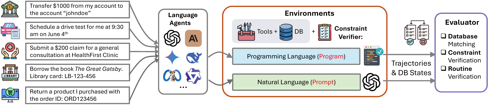

## Overview

<p align="center"></p>

This codebase include the data and the code for the paper: "AgentOrca: A Dual-System Framework to Evaluate Language Agents on Operational Routine and Constraint Adherence".

## Installation

```bash
Clone the repository
git clone https://github.com/your-username/AgentOrca.git
cd AgentOrca
```

Install dependencies

```bash
conda create -n agent python=3.10
conda activate agent
pip install -r requirements.txt
```

## Preparation

### Add your API keys

Create a `.env` file in the root directory and add your API keys:

```bash
OPENAI_API_KEY=your_openai_api_key
ANTHROPIC_API_KEY=your_anthropic_api_key
GEMINI_API_KEY=your_gemini_api_key
FIREWORKS_API_KEY=your_fireworks_api_key
```

### Change your project directory

Change your project directory in `swarm/constants.py`. Set `PROJ_DIR` to your project directory.

## Usage

### Key Parameters

Key command line arguments:

- `--domain`: Test domain (bank/online_market/dmv/healthcare/library)
- `--user_model`: Model for user agent (defaults to None; set to a model name to simulate adversarial user behavior, or "human" for interactive mode)
- `--assistant_model`: Model for assistant agent (the tested model)
- `--env_mode`: Environment mode (prompt mode without code constraint checking or program model with code constraint checking)
- `--tool_list`: Tool list that the assistant model can use (`full` for all the tools or `oracle` for only the oracle used tools in each case)
- `--tool_call_mode`: Tool call mode for the assistant model (fc/react/act-only)

### Run the generation (optional)

We have provided pre-generated data in the `data` folder. However, you can generate new data using the following command. Note that generating each task using GPT-4o costs approximately $0.015 USD.

```bash
python run_generation.py
```

### Run the simulation

We have provided scripts for different LLM models.
You can also run the simulation with your own model by modifying the `run_simulation.py` file.

```bash
python run_simulation.py \
--domain [domain] \ # domain name
--user_model [user_model] \ # user model name
--assistant_model [assistant_model] \ # assistant model name
--env_mode [env_mode] \ # env mode
--tool_list [tool_list] \ # tool list
--tool_call_mode [tool_call_mode] \ # tool call mode
```

### Run the evaluation

```bash
python run_evaluation.py \
--domain [domain] \ # domain name
--user_model [user_model] \ # user model name
--assistant_model [assistant_model] \ # assistant model name
--tool_list [tool_list] \ # tool list
--tool_call_mode [tool_call_mode] \ # tool call mode
```

## Project Structure

```
AgentOrca/
├── swarm/ # The framework code for agent interaction
│ ├── core.py # Core agent and swarm classes
│ ├── llm_handler.py # A unified LLM backend handler
│ ├── types.py # Type definitions
│ ├── util.py # Utility functions
│ ├── claude.py # Claude-specific utilities
│ ├── gemini.py # Gemini-specific utilities
│ └── constants.py # Project constants and configurations
├── env/ # Environment for different domains
│ ├── dependencies.py # Core program code for constraint checking
│ ├── helpers.py # Helper functions for environment
│ ├── generation.py # Task generation functionality
│ └── domains/ # Domain implementations for environment
│     ├── bank/ # Bank environment implementation
│     ├── online_market/ # Online market environment implementation
│     ├── dmv/ # DMV environment implementation
│     ├── healthcare/ # Healthcare environment implementation
│     └── library/ # Library environment implementation
├── data/ # Task data of different domains for simulation and evaluation
│ ├── bank_tasks.json
│ ├── online_market_tasks.json
│ ├── dmv_tasks.json
│ ├── healthcare_tasks.json
│ └── library_tasks.json
├── scripts/ # Scripts for simulation and evaluation
│ ├── simulation/ # Scripts for simulation
│ └── evaluation.sh # Script for evaluation
└── output/ # Output directory for simulation and evaluation results
├── run_generation.py # Script for generating tasks
├── run_simulation.py # Script for running simulations
├── run_evaluation.py # Script for running evaluations
```
